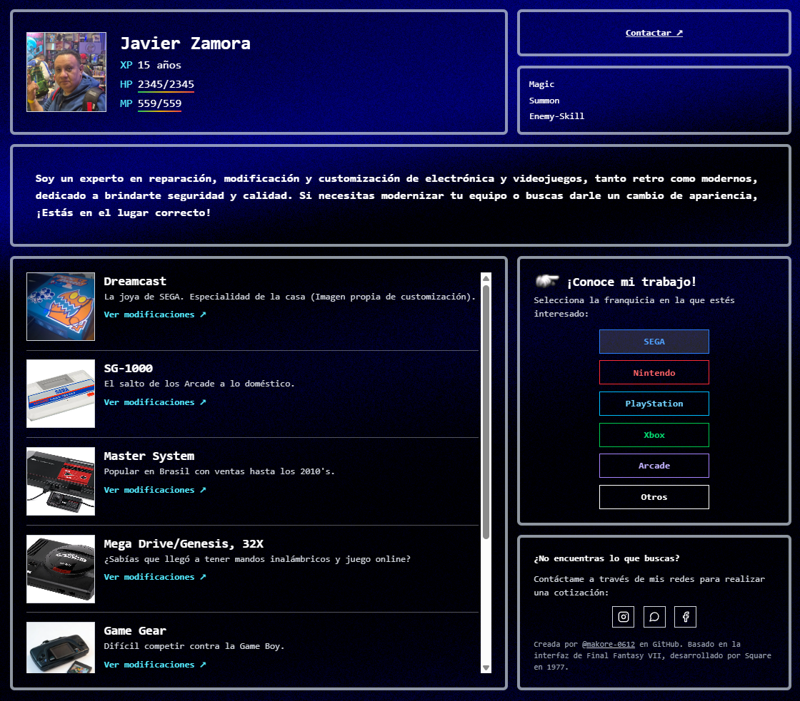

# Modificador de Consolas

Sitio de trabajo de Javier Zamora — reparación, modificación y customización de
consolas y electrónica. La interfaz está inspirada en el menú de Final
Fantasy VII.

**Sitio en vivo:** https://makore-0612.github.io/modificadorconsolas/



## Stack

- React + Vite (JavaScript)
- Tailwind CSS v4
- React Router (`HashRouter`, para que funcione en GitHub Pages)
- Fondo animado `<Silk />` con `three` + `@react-three/fiber`
- Despliegue automático a GitHub Pages vía GitHub Actions

## Cómo editar el contenido

Toda la información de franquicias, consolas y modificaciones vive en
[`public/modificaciones.json`](public/modificaciones.json), organizada así:

```
{
  "franquicia-slug": [
    {
      "nombre": "Nombre visible",
      "slug": "identificador-unico",
      "descripcion": "Texto corto",
      "imagen": "img/archivo.png",
      "modificaciones": [
        {
          "nombre": "...",
          "descripcion": "...",
          "precio": "$3,141.61 MXN",
          "imagen": "img/archivo.png"
        }
      ]
    }
  ]
}
```

- El `slug` de cada consola debe ser único dentro de su franquicia; se usa en
  la URL (`#/franquicia/:fSlug/consola/:cSlug`).
- Las imágenes van dentro de `public/img/` y se referencian con esa misma ruta
  relativa (ej. `"img/switch.png"`). Si la ruta no existe todavía, se muestra
  un placeholder automáticamente en vez de romperse.
- Los cambios a este archivo no requieren recompilar: se leen en tiempo real
  con `fetch` al cargar la página.
